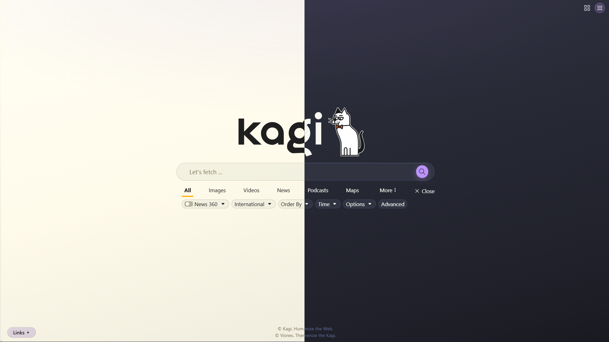

# ⚠️ Repository Moved

> [!WARNING]
> **This repository is archived and no longer maintained.**
>
> **The project has moved to:**
>
> ## ➡️ https://github.com/dracula/kagi
>
> Please use the new repository for all future issues, pull requests, and updates.

# Dracula for [Kagi](https://kagi.com)

> A dark (and light) theme for [Kagi](https://kagi.com).

## Install

All instructions can be found at [draculatheme.com/kagi](https://draculatheme.com/kagi).

## Team

This theme is maintained by the following person(s) and a bunch of [awesome contributors](https://github.com/dracula/kagi/graphs/contributors).

|  |
--------------------------------------------------------------------------------------------- |
| [Visnes](https://github.com/Visnes) |

## Community

- [Twitter](https://twitter.com/draculatheme) - Best for getting updates about themes and new stuff.
- [GitHub](https://github.com/dracula/dracula-theme/discussions) - Best for asking questions and discussing issues.
- [Discord](https://draculatheme.com/discord-invite) - Best for hanging out with the community.

## Dracula PRO

## License

[MIT License](./LICENSE)
